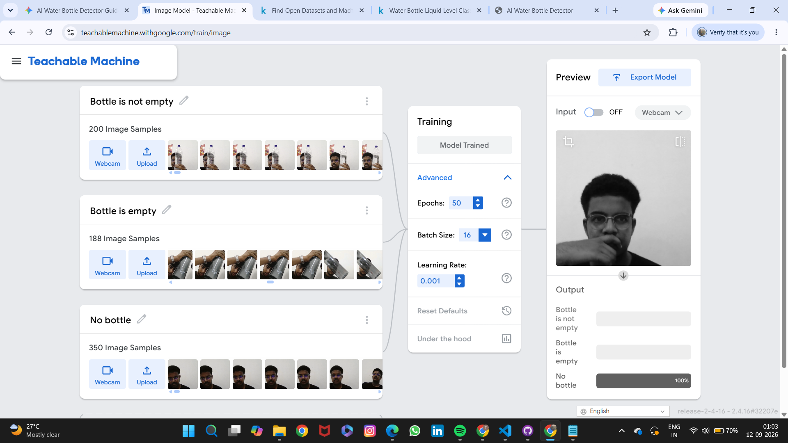
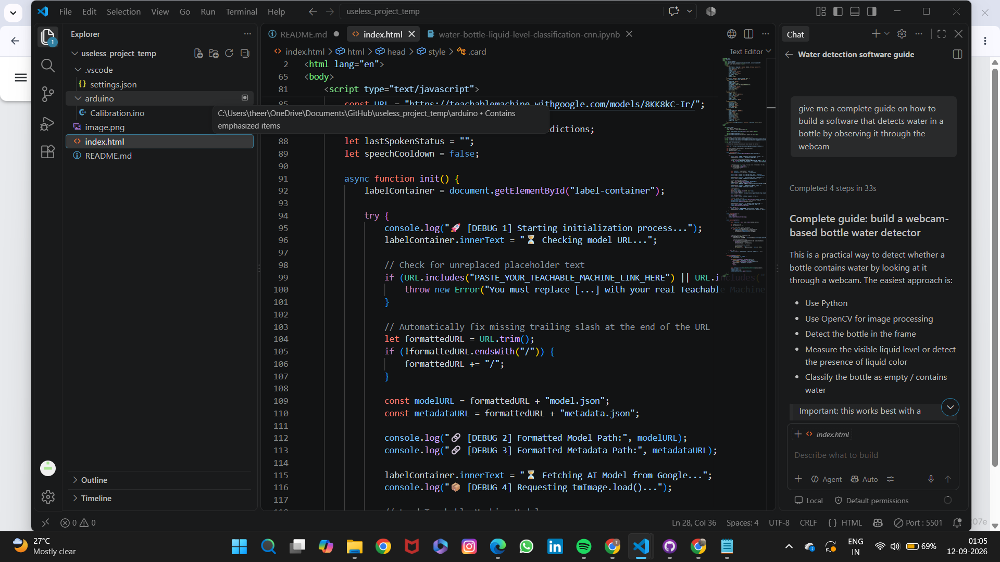
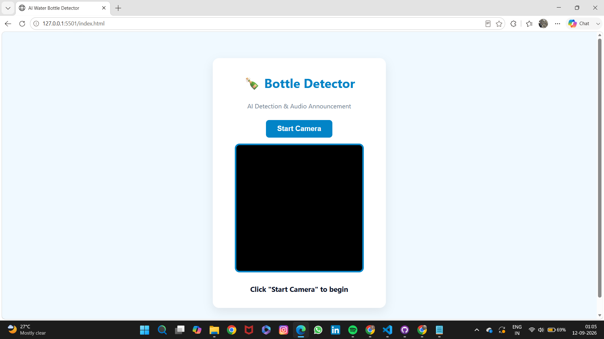

# [Bottle checker] 🎯

## Basic Details
### Team Name: [3 Kings]

### Team Members
- Team Lead: [Nakul R Krishna] - [GEC Thrissur]
- Member 2: [Tharun S] - [GEC Thrissur]
- Member 3: [Name] - [College]

### Project Description
[An interactive web application that uses real-time computer vision to detect whether a water bottle is empty or full using a webcam. Powered by a TensorFlow.js machine learning model and the native Web Speech API, the system visually displays detection confidence and broadcasts automated voice alerts as bottle status changes. Designed for smart utility and hands-free accessibility, it provides a seamless bridge between visual AI detection and instant audio notifications.]

### The Problem (that doesn't exist)
[Why waste precious human energy looking at a water bottle when you can deploy a high-powered neural network to stare at it for you?]

### The Solution (that nobody asked for)
[We solved the tragic human error by building an over-engineered AI surveillance system that constantly watches your water level. Instead of using your own precious eyes, our website uses your laptop webcam to track the liquid in real time and triggers an immediate voice alert the second it detects empty space,letting you know if the bottle is empty or not.]

## Technical Details
### Technologies/Components Used
For Software:
- [HTML5, CSS3, JavaScript (ES6+)]
- [Teachable Machine (TensorFlow.js ecosystem)]
- [Libraries used]
- [Visual Studio Code, Live Server extension, Google Teachable Machine, GitHub & GitHub Pages]

For Hardware:
- [List main components]
- [List specifications]
- [List tools required]

### Implementation
For Software:
# Installation
[commands]

# Run
[commands]

### Project Documentation
For Software:

# Screenshots (Add at least 3)
](Add screenshot 1 here with proper name)
*AI model training using teachable machine*

](Add screenshot 2 here with proper name)
*Developing in VS code*

](Add screenshot 3 here with proper name)
*Interface of the website*

# Diagrams

*Add caption explaining your workflow*

For Hardware:

# Schematic & Circuit

*Add caption explaining connections*

*Add caption explaining the schematic*

# Build Photos

*List out all components shown*

*Explain the build steps*

*Explain the final build*

### Project Demo
# Video
[Add your demo video link here]
*Explain what the video demonstrates*

# Additional Demos
[Add any extra demo materials/links]

## Team Contributions
- [Name 1]: [Specific contributions]
- [Name 2]: [Specific contributions]
- [Name 3]: [Specific contributions]

---
Made with ❤️ at TinkerHub Useless Projects 

